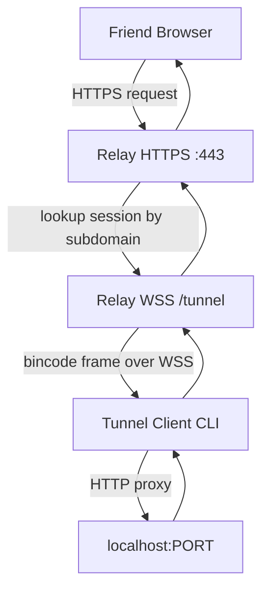
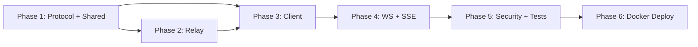

# TunnelX MVP Implementation Plan

## Current State

The repository at [`/home/jocky/Project/tunnelX`](/home/jocky/Project/tunnelX) is empty. This is a greenfield build aligned with the PRD, adapted for your domain **`darsha.dev`** (URLs like `https://green-cat-84.darsha.dev`) and **Docker on a single Linux VPS**.

---

## Architecture



**Data flow for a single HTTP request:**

1. Browser hits `https://green-cat-84.darsha.dev/api/users`
2. Relay resolves subdomain → active session in `DashMap`
3. Relay serializes request into a `TunnelFrame::HttpRequest` and sends over WSS to the client
4. Client forwards to `http://127.0.0.1:3000/api/users` via Hyper
5. Client sends `TunnelFrame::HttpResponse` (status, headers, body chunks) back
6. Relay streams response to browser

**WebSocket/SSE:** Same path, but the connection stays open and frames are proxied bidirectionally (see Phase 4).

---

## Repository Layout

Scaffold a Cargo workspace matching PRD section 19:

```
tunnelX/
├── Cargo.toml              # workspace root
├── README.md
├── client/
│   ├── Cargo.toml
│   └── src/
│       ├── main.rs         # CLI entry (clap)
│       ├── connector.rs    # WSS connection + reconnect
│       ├── proxy.rs        # localhost HTTP/WS proxy
│       └── heartbeat.rs
├── relay/
│   ├── Cargo.toml
│   └── src/
│       ├── main.rs
│       ├── server.rs       # Axum HTTPS + WSS router
│       ├── session.rs      # DashMap session store
│       ├── router.rs       # subdomain → session routing
│       ├── url_gen.rs      # adjective-noun-number generator
│       └── cleanup.rs      # dead session sweeper
├── protocol/
│   ├── Cargo.toml
│   └── src/
│       ├── lib.rs
│       ├── frame.rs        # TunnelFrame enum
│       ├── http.rs         # Serialized HTTP types
│       └── codec.rs        # bincode encode/decode helpers
├── shared/
│   ├── Cargo.toml
│   └── src/
│       ├── lib.rs
│       ├── error.rs
│       └── config.rs       # env-based relay config
├── tests/
│   └── integration_test.rs
├── docker/
│   ├── Dockerfile.relay
│   └── docker-compose.yml
└── docs/
    └── deployment.md
```

---

## Phase 1 — Workspace + Protocol Foundation

### 1.1 Cargo workspace

Root [`Cargo.toml`](/home/jocky/Project/tunnelX/Cargo.toml):

- Workspace members: `client`, `relay`, `protocol`, `shared`
- Shared deps: `tokio`, `serde`, `bincode`, `tracing`, `thiserror`, `uuid`

### 1.2 Protocol crate (`protocol/`)

Define the wire format — all communication between client and relay uses **bincode-serialized frames over WebSocket binary messages**.

Core types in `protocol/src/frame.rs`:

```rust
pub enum TunnelFrame {
    // Session lifecycle
    Register { token: String },
    Registered { subdomain: String, public_url: String },
    Heartbeat,
    HeartbeatAck,
    Disconnect,

    // HTTP proxying
    HttpRequest {
        request_id: u64,
        method: String,
        path: String,
        headers: Vec<(String, String)>,
        body: Vec<u8>,
    },
    HttpResponseHeader {
        request_id: u64,
        status: u16,
        headers: Vec<(String, String)>,
    },
    HttpResponseBody {
        request_id: u64,
        chunk: Vec<u8>,
        finished: bool,
    },

    // WebSocket upgrade
    WsOpen { request_id: u64, path: String, headers: Vec<(String, String)> },
    WsFrame { request_id: u64, data: Vec<u8>, opcode: u8 },
    WsClose { request_id: u64 },

    // Errors
    Error { code: u16, message: String },
}
```

Key design choices:
- **Chunked bodies** — avoid loading large responses into memory; stream in 64 KB chunks
- **`request_id`** — correlates request/response pairs; supports concurrent requests on one tunnel
- **Version field** in a handshake header (future-proofing, not enforced in MVP)

### 1.3 Shared crate (`shared/`)

- `TunnelError` enum with variants: `RelayUnavailable`, `LocalhostDown`, `SessionExpired`, `ProtocolError`
- `RelayConfig` struct: `bind_addr`, `domain` (default `darsha.dev`), `tls_cert_path`, `tls_key_path`
- Constants: heartbeat interval (30s), session timeout (90s), max body size (10 MB)

---

## Phase 2 — Relay Server

### 2.1 Session management (`relay/src/session.rs`)

```rust
struct Session {
    id: Uuid,
    subdomain: String,
    token: String,           // random 32-byte hex
    client_tx: mpsc::Sender<TunnelFrame>,
    created_at: Instant,
    last_heartbeat: Instant,
}
```

- `DashMap<String, Session>` keyed by subdomain
- On client WSS connect: validate token, insert session, return public URL
- On disconnect or missed heartbeat: remove session immediately (FR-011, FR-012)

### 2.2 URL generation (`relay/src/url_gen.rs`)

Format: `{adjective}-{noun}-{number}.darsha.dev`

- Word lists: ~200 adjectives, ~200 nouns (embedded as `&'static [&str]`)
- Random 2-digit number (10–99)
- Collision check against active sessions; retry up to 5 times

### 2.3 HTTP ingress (`relay/src/server.rs`)

Axum router with two listeners:

| Route | Purpose |
|-------|---------|
| `GET/POST/... /*path` on `*.darsha.dev` | Public HTTP ingress — extract subdomain from `Host` header, lookup session, forward as `HttpRequest` frame |
| `GET /tunnel` (WSS upgrade) | Client connection endpoint |

**Subdomain routing:** Parse `Host: green-cat-84.darsha.dev` → lookup `green-cat-84` in `DashMap`.

**Error responses (PRD section 15):**

| Condition | HTTP Status |
|-----------|-------------|
| Unknown subdomain | 404 |
| Client disconnected | 503 |
| Localhost unreachable (client reports) | 502 |
| Relay overloaded | 503 |

### 2.4 TLS

- Use `rustls` + `axum-server` with TLS config
- Production: mount Let's Encrypt wildcard cert for `*.darsha.dev` via Docker volume
- Local dev: generate self-signed cert with `mkcert` or a dev-only flag `--insecure`

### 2.5 Background tasks

- **Heartbeat checker** (every 30s): evict sessions with no heartbeat in 90s
- **Graceful shutdown**: on SIGTERM, notify all clients, drain sessions

---

## Phase 3 — Client CLI

### 3.1 CLI (`client/src/main.rs`)

Using `clap`:

```
tunnelx [PORT]              # positional port (default none, required)
tunnelx --port 3000         # explicit flag
tunnelx --relay wss://relay.darsha.dev/tunnel  # override relay URL
```

Startup sequence:
1. Parse args
2. Connect to relay WSS endpoint
3. Send `Register` frame with random token
4. Receive `Registered { subdomain, public_url }`
5. Print public URL to stdout: `Tunnel active: https://green-cat-84.darsha.dev`
6. Enter event loop: receive frames, proxy to localhost, send responses

### 3.2 Localhost proxy (`client/src/proxy.rs`)

- Use `hyper` client to forward HTTP requests to `http://127.0.0.1:{port}`
- Preserve method, path, query string, headers, body
- Strip hop-by-hop headers (`Connection`, `Transfer-Encoding`, `Upgrade`)
- Stream response body back in chunks via `HttpResponseHeader` + `HttpResponseBody` frames
- Handle concurrent requests: spawn a Tokio task per `request_id`

### 3.3 Connection resilience (`client/src/connector.rs`)

- Exponential backoff on relay disconnect (1s, 2s, 4s, 8s, max 30s) — PRD section 15
- On reconnect: session is gone (by design); print message and exit
- Ctrl+C / SIGINT: send `Disconnect` frame, exit cleanly

### 3.4 Heartbeat (`client/src/heartbeat.rs`)

- Send `Heartbeat` frame every 30s
- Expect `HeartbeatAck` within 10s; if missing, attempt reconnect

---

## Phase 4 — WebSocket, SSE, and Streaming

These are the hardest parts and define MVP completeness.

### 4.1 WebSocket proxying

When relay receives an HTTP upgrade request (`Connection: Upgrade`):

1. Relay sends `WsOpen` frame to client with original headers
2. Client opens a WebSocket to `ws://127.0.0.1:{port}{path}`
3. Relay completes the upgrade with the browser
4. Bidirectional `WsFrame` proxying between browser ↔ relay ↔ client ↔ localhost
5. On either side closing: send `WsClose`, clean up

Implementation: use `tokio-tungstenite` on both relay (browser side) and client (localhost side).

### 4.2 Server-Sent Events (SSE)

SSE is long-lived HTTP with `Content-Type: text/event-stream`:

- Treat as a streaming HTTP response — relay sends `HttpResponseHeader` with status 200, then streams `HttpResponseBody` chunks as events arrive from localhost
- No special frame type needed; chunked transfer handles it

### 4.3 Static files / large payloads

- Stream bodies in 64 KB chunks (never buffer full file in memory)
- Support `Content-Length` and chunked transfer encoding
- No request/response body logging (PRD NFR)

---

## Phase 5 — Error Handling, Security, and Observability

### 5.1 Security checklist

- TLS 1.3 only (configure `rustls` to reject older versions)
- Random 32-byte session tokens (use `rand` crate)
- Client connects outbound only — no inbound ports on client (FR-002)
- No persistent sessions — token invalidated on disconnect
- Heartbeat validation prevents stale session hijack
- No logging of request/response bodies

### 5.2 Logging (`tracing`)

- Client: connection status, public URL, errors
- Relay: session create/destroy, connection count, errors
- Structured JSON logs in production; pretty logs in dev
- Log level via `RUST_LOG` env var

### 5.3 Integration tests (`tests/integration_test.rs`)

End-to-end test (no real domain needed):

1. Start a mock localhost server (Axum on random port)
2. Start relay on localhost with self-signed TLS
3. Start client pointing to local relay
4. HTTP GET through the tunnel → verify response body
5. POST with JSON body → verify round-trip
6. Kill client → verify tunnel returns 503
7. WebSocket upgrade → verify bidirectional message

---

## Phase 6 — Deployment

### 6.1 DNS setup (prerequisite)

On your DNS provider for `darsha.dev`:

```
A     relay.darsha.dev        → <VPS_IP>
A     *.darsha.dev            → <VPS_IP>
```

### 6.2 Docker (`docker/`)

**`Dockerfile.relay`** — multi-stage build:
- Stage 1: `rust:1.85-bookworm` — build release binary
- Stage 2: `debian:bookworm-slim` — copy binary, expose 443

**`docker-compose.yml`:**

```yaml
services:
  relay:
    build:
      context: ..
      dockerfile: docker/Dockerfile.relay
    ports:
      - "443:443"
    volumes:
      - /etc/letsencrypt:/certs:ro
    environment:
      - RUST_LOG=info
      - RELAY_DOMAIN=darsha.dev
      - TLS_CERT=/certs/live/darsha.dev/fullchain.pem
      - TLS_KEY=/certs/live/darsha.dev/privkey.pem
    restart: unless-stopped
```

TLS cert provisioning: use Certbot with DNS challenge for wildcard `*.darsha.dev` (or Caddy with automatic HTTPS as an alternative noted in docs).

### 6.3 Client distribution

MVP: build from source (`cargo install --path client`).

Future: GitHub Releases with prebuilt binaries for Linux/macOS/Windows.

---

## Implementation Order and Dependencies



Phases 2 and 3 can partially overlap once the protocol is stable — relay and client can be developed against a shared protocol test fixture.

---

## Key Dependencies (Cargo)

| Crate | Used In | Purpose |
|-------|---------|---------|
| `tokio` | all | Async runtime |
| `axum` | relay | HTTP server + routing |
| `hyper` | client | Localhost HTTP client |
| `tokio-tungstenite` | client, relay | WebSocket |
| `rustls` + `axum-server` | relay | TLS 1.3 |
| `clap` | client | CLI parsing |
| `serde` + `bincode` | protocol | Serialization |
| `dashmap` | relay | Concurrent session map |
| `tracing` | all | Logging |
| `uuid` | relay | Session IDs |
| `rand` | relay, client | Token/URL generation |
| `thiserror` | shared | Error types |

---

## Risks and Mitigations

| Risk | Mitigation |
|------|------------|
| WebSocket tunneling complexity | Implement HTTP proxy first (Phase 3), add WS in Phase 4 with dedicated integration test |
| Wildcard TLS cert provisioning | Document Certbot DNS challenge steps; provide self-signed dev mode |
| Concurrent request handling on single WSS | Use `request_id` correlation + per-request Tokio tasks |
| Large file streaming memory pressure | 64 KB chunked streaming, never buffer full body |
| Subdomain collisions | Retry with new random combo; 40,000 possible combos with current word lists |

---

## Success Criteria (MVP Done When)

- `tunnelx 3000` prints a public HTTPS URL within 2 seconds
- Friend opens URL in browser, sees localhost app (React/Vite dev server)
- REST API calls (GET/POST/JSON) work through tunnel
- WebSocket connections work (e.g., Vite HMR)
- Closing the client immediately returns 503 on the public URL
- Client memory stays under 30 MB
- Relay runs in Docker on VPS with valid TLS for `*.darsha.dev`
